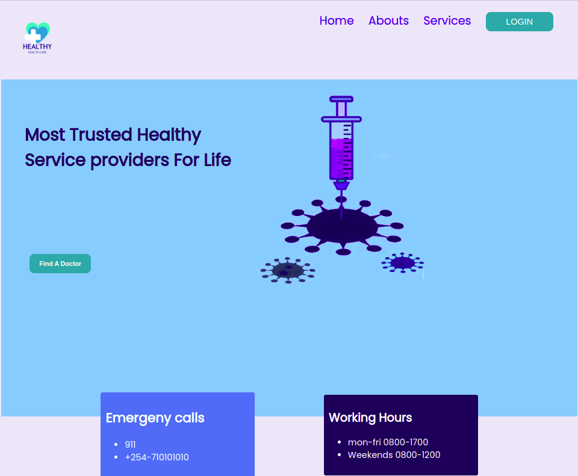

# HEALTHY
***
## DESCRIPTION
Healthy is a website that specializes in medical services. The services are brought closer to the user for easy access at any time. Any patient can be able to book an appointment at any time with any of the doctors that are specialized in a specific section in medicine i.e Heart issues.
Below is a clear working example of the page.
<br>

## [FEATURES](https://jobsidney.github.io/Heathy/)
- Well Designed Interface(UI).
- intensive use of Vanilla css for design
- Javascript
- HTML5
- Switch to multiple pages via links and buttons
- Responsive to variety of devices like mobile,tablet and PC

### Target to future improvement
- Incoperate JQuery,Nodejs
- Add Animated background

### Program Sample
#### Html code
```Html
  <section id="examSec">
        <div class="examText">
            Try Our online Programming Test. <br>Happy coding...
        </div>
        <div class="btn2">
            <a href="./assets/html/page2.html" target="_self">
                Take Test Now
            </a>
        </div>
    </section>
```

#### Css
Example of Css with media query for responsiveness
```Css
@media screen and (max-width:700px) {
    #NavBar>div>img{
        width: 100px;
    }
    #NavBar>nav{
        padding-right: 1px;
    }
    #NavBar>nav>ul>li{
        list-style: none;
        font-size: x-large;
    }
    #NavBar>nav>ul>li>a>button{
        font-size: large;
    }
```
#### Javascript
Example of working javascript code
```Javascript
    var userDetails = {
        userEmail : email,
        userPassword : password
    };

    var convertToJson = JSON.stringify(userDetails);
    localStorage.setItem("UserDetails", convertToJson);
    alert("Sign up successful");

}

```

## Installation
CLick the link provided: https://jobsidney.github.io/Heathy/
#### requirements:
- chrome browser/any other browser
- any type of computer(phone of laptop)
- Internet connection

## Contribution
The process below will enable you make contribution to this website for a better view and functionality

- Fork the repo
- Create a new branch (`git checkout -b AddingFeatures`).
- Make the changes you want to the files and folders.
- Add the changes (`git add .`).
- to reflect the changes.
- commit changes (`git commit -m 'This is a Proj COntribution commit'`).
- push changes to the branch (`git push origin AddingFeatures`).
- Do a pull Request. 
## AUTHORS
- Steve Otieno
- Sarah Mukuti
- Gilbert Cheruiyot
- Job SIdney
## LICENCE
### The MIT License
[](https://opensource.org/licenses/MIT)  
`[](https://opensource.org/licenses/MIT)`


